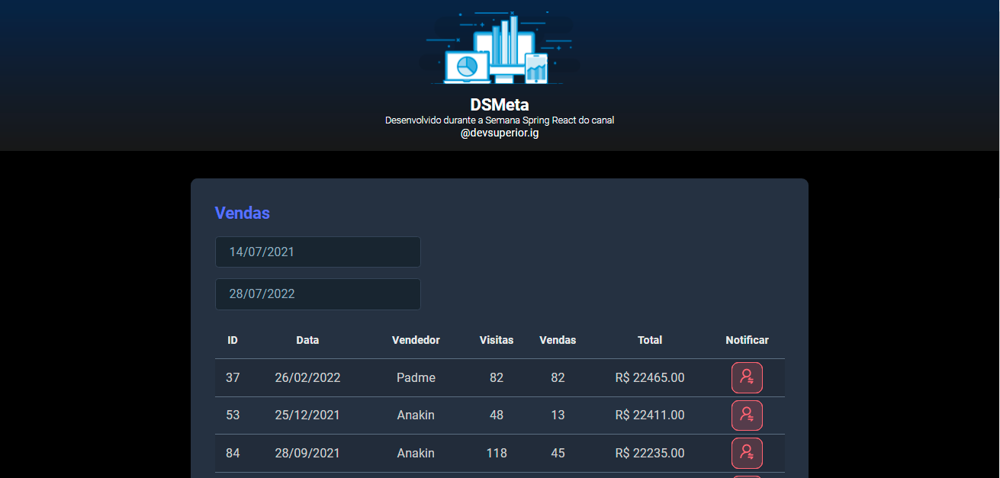

<h1 align="center">
  
   Hello Stranger... Welcome to  DSmeta
</h1>

 

  Projeto realizado durante a Semana Spring React com objetivo de estudo, com base num banco de dados pré-definido podemos filtrar as vendas de acordo com um periodo 
  estabelecido pelo usuário e notificar via SMS ao clicar no botão Notificar. Link para o site funcionando <a href="https://dsmeta-vvieira.netlify.app">AQUI!</a>. 

 

 

## Realização

[DevSuperior - Escola de programação](https://devsuperior.com.br)

 

## ✨ Tecnologias

Esse projeto foi desenvolvido com as seguintes tecnologias:

- &nbsp;
- &nbsp;
- &nbsp;
- &nbsp;
- &nbsp;

 

## ✨ Hosting
- &nbsp;
- &nbsp;

- E para implementar a funcionalidade de notificação por SMS 
- &nbsp;
